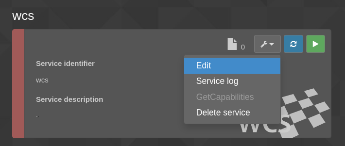
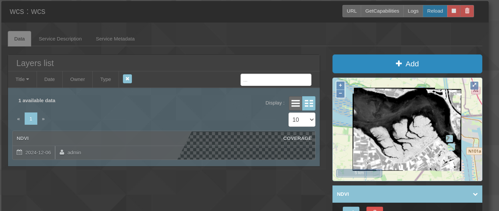

## How do you retrieve the id of the data you want to use ? (and the service Id)

1. First create a **WCS** service in the **Web services** tab

2. Set a name and an **Identifier** (keep it, it's the **serviceId**), and check versions 1.0.0 **AND** 2.0.1

3. Once done, click on the **Edit** button, and add you data (select the data, and click on **Choose**). Then start the WCS service.

4. The dataId correspond to the name / identifier of the data in the service (here NDVI)
