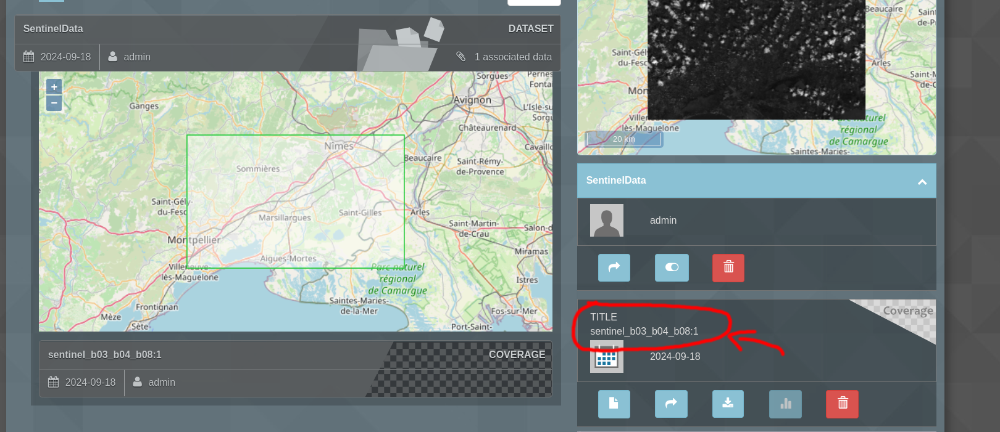

## How do you retrieve the id of the data you want to use ?

1. In the Examind **Data** tab, click on the dataset where you imported your data. 

2. Then select the data you want at the bottom. 

3. You will find the id at the bottom right of your screen (see screenshot)

