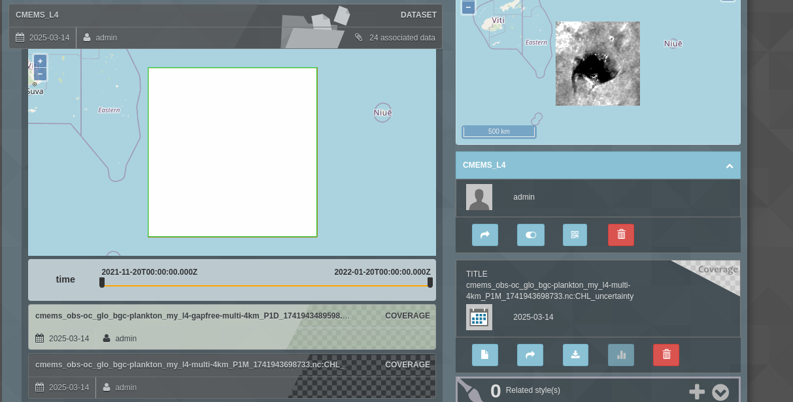
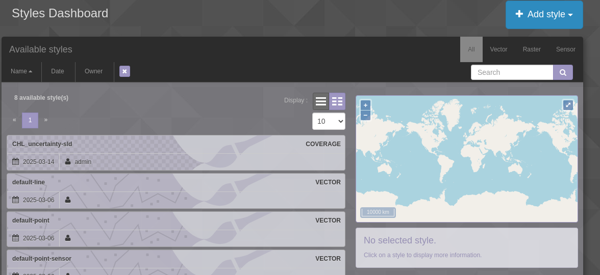
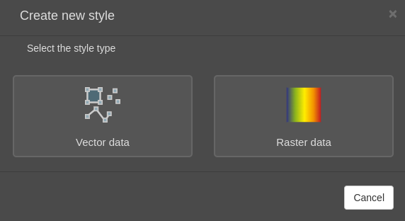
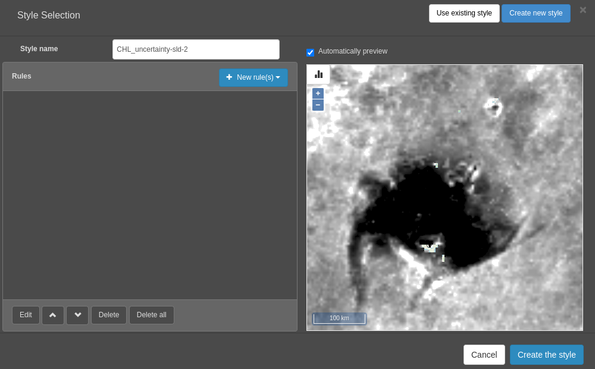
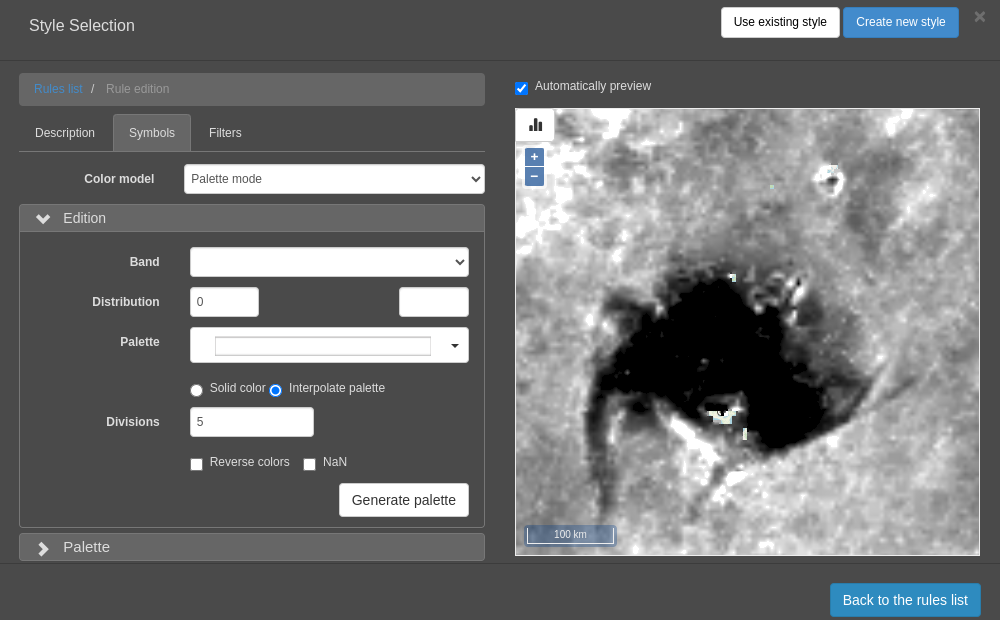
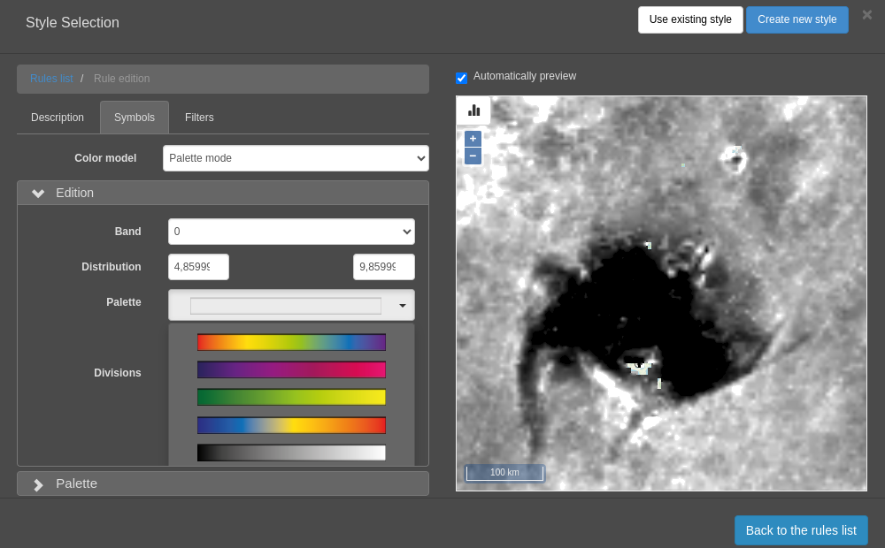
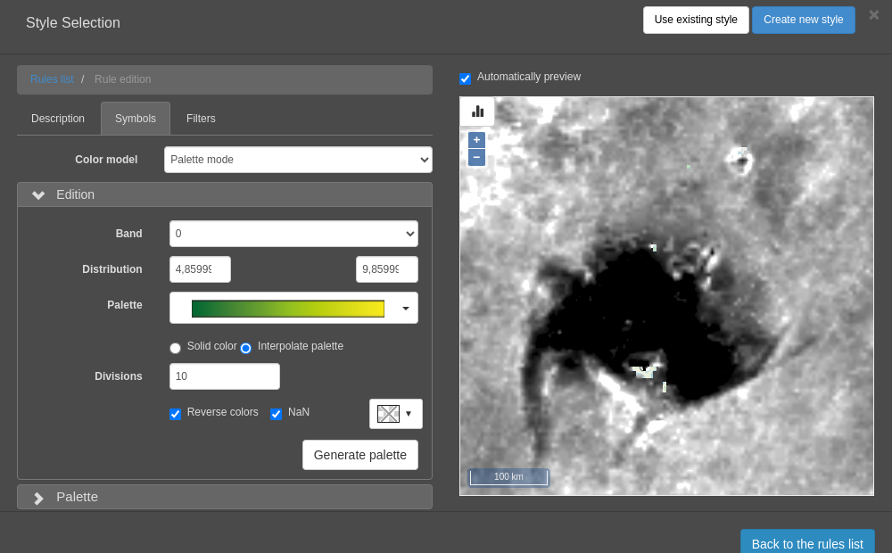
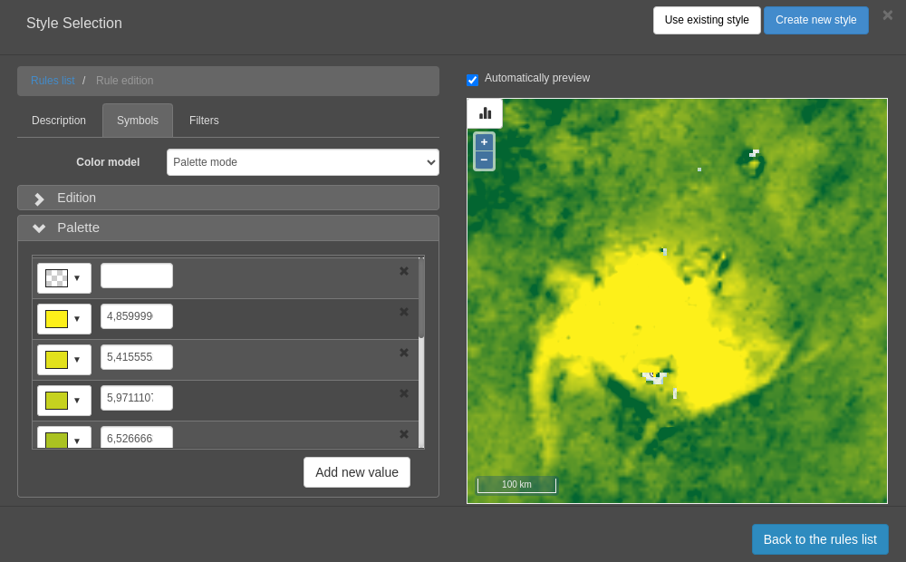

## How to style my data in Examind ?

1. You have different ways to add a style. 
   - You can create a style using a specific data uploaded on Examind (*available during the "Add data" process, or if you click on a data in **Data** tab*)
   
   *(bottom right of the screenshot)*
   - You can crate a generic style (*available in the **Styles** tab*)
   
   Then you need to choose between Vector or Raster style.
   

---

**Notes :**
- It's easier to create a "specific" style for a specified data, because you can see the result directly, 
  and because examind can help you during the creation (it can show the min/max of your data to create a color palette, ...)
- If you know your image (its metadata, its values, ...), you can create a generic style, and use it for multiple data.

---

In this tutorial, i will work on a specific raster data.

2. In the **Style Selection** pop up, you can click on **Create new style**. You will have something like this
   
3. You can add different rules to your style :
   - **Color and Palette** (if you want specific color palette) *(we will use this here)*
   - **Group of cells** (for vectors data)
   - **Dynamic ranges**
4. Select **Color and Palette**, set a name, a title and a description if you want, and click on **Symbols** tab
5. You will have this interface :
   
6. In **Color Model** you can choose between :
   - **Palette Mode** : Selection of a band, to create a color palette
   - **RGB Composition Mode** : Selection of which band will be used for Red, Green, and Blue
   - **Grayscale Mode** : Same as color palette, but you will generate a style in grayscale directly
7. Here we will crate a color palette. Select the **band** you want to use. Examind will fill the min/max values of your data.
   You can change these values if you want.
8. Select a palette you want
   
9. Set a number of division (number of colors in your palette)
10. Check "reverse colors" and/or "NaN" if you want. In my case, I have something like that :
    
11. Click on **Generate Palette**
12. You will have a preview of your palette. You can change the colors if you want.
    
13. Click on **Back to the rules list**, add as much rules as you want, and click on **Create the style**.