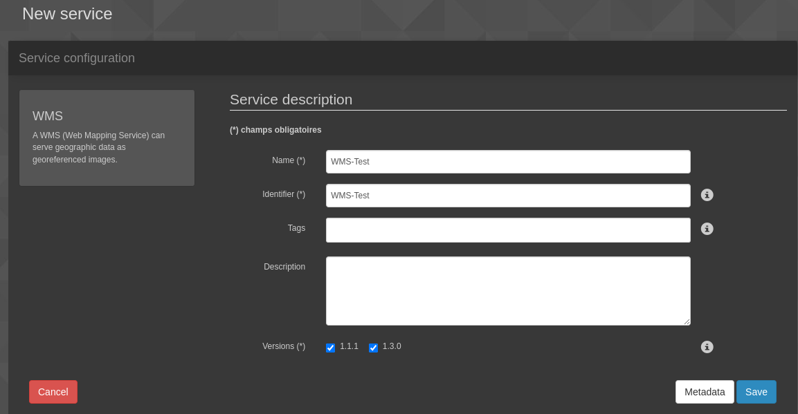
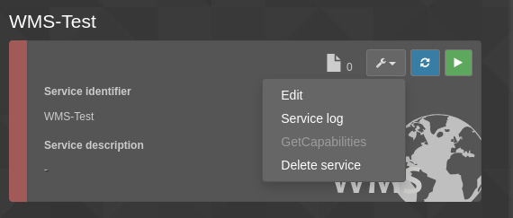
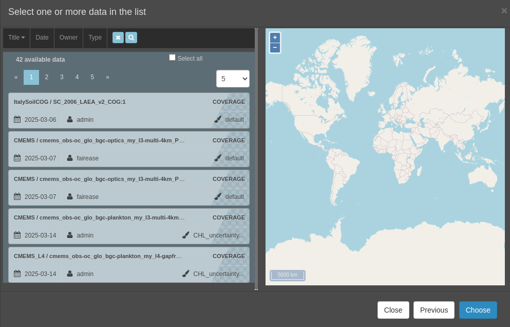
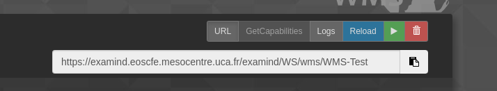

## WMS Setup Example

1. in **Web services** tab, click on **Create a service**, and click on **Maps (WMS)**
2. In the form, set a name, a title, and check versions 1.1.1 **AND** 1.3.0
   
3. Click on **Save**
4. Click on **Edit** on the wms tile created
    
5. Click on **Add new layer**, then **Map layers**
6. Here you can select a list of layer you want in the wms

7. Once a list of layer is selected, you can start the service (green button). You have the URL if you click on the "URL" button
